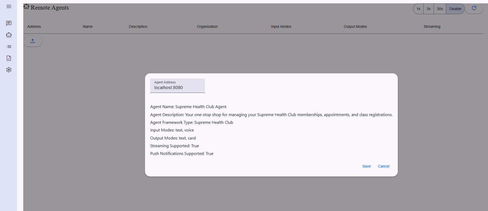
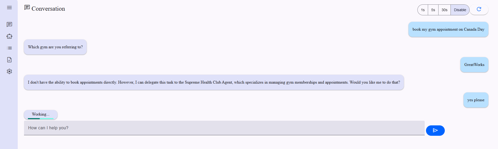
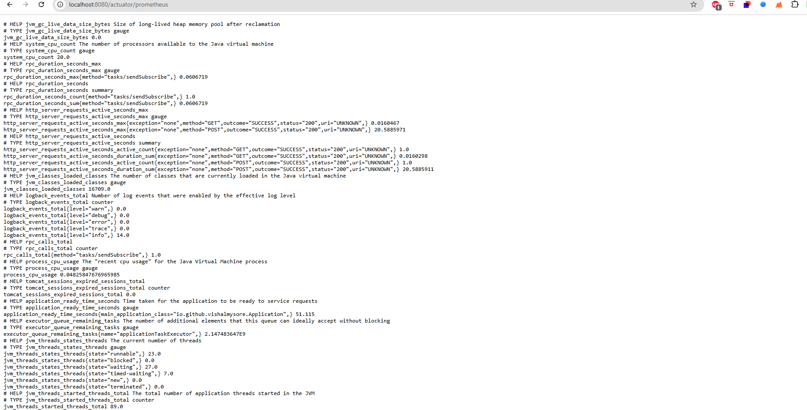
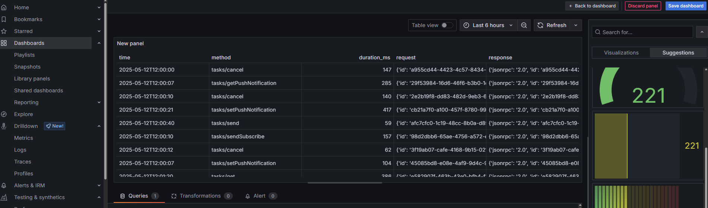
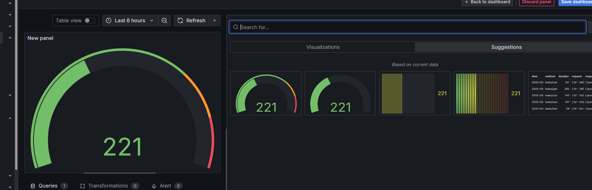

# A2A Protocol with Grafana Integration

[](https://choosealicense.com/licenses/mit/)
[](https://www.oracle.com/java/technologies/javase/jdk23-archive-downloads.html)
[](https://spring.io/projects/spring-boot)

## Overview

Google's Agent-to-Agent (A2A) protocol is a powerful framework that enables AI agents to communicate and collaborate effectively. This project demonstrates how to implement A2A with comprehensive observability using Grafana, showcasing a health club service agent as an example.  
A2AJava is the Java implementation of the Google A2A protocol you can check the project [here](https://github.com/vishalmysore/a2ajava) .

### Deep Task Observability

The system can provides comprehensive visibility into agent interactions:

#### 1. Task Execution Monitoring
- **Task Lifecycle**: Track tasks from initiation to completion
- **Real-time Status**: Monitor active tasks and their current states
- **Execution Metrics**: Measure task duration, success rates, and failure patterns
- **Task Dependencies**: Visualize task chains and dependencies between agents

#### 2. Parameter Tracing
- **Input Parameters**: Monitor all parameters sent to agent tasks
- **Parameter Validation**: Track parameter validation success/failure rates
- **Parameter Usage Patterns**: Analyze common parameter combinations
- **Type Safety**: Monitor parameter type mismatches and conversion issues

#### 3. JSON-RPC Communication
- **Request/Response Tracking**: Complete visibility of all JSON-RPC messages
- **Payload Analysis**: Monitor request/response payload sizes and patterns
- **Error Rates**: Track RPC failures and error types
- **Latency Metrics**: Measure round-trip times for RPC calls
- **Protocol Compliance**: Ensure adherence to A2A protocol standards

### Why A2A Protocol?
The A2A protocol facilitates:
- **Standardized Communication**: Enables AI agents to expose their capabilities and interact using a common protocol
- **Real-time Interaction**: Supports streaming capabilities for live agent-to-agent communication
- **Capability Discovery**: Agents can dynamically discover and utilize each other's functions
- **Scalable Architecture**: Supports multiple agents working together in a distributed system

### Why Observability Matters?
In a multi-agent system, observability is crucial for:
- **Performance Monitoring**: Track each agent's response times and throughput
- **Behavior Analysis**: Understand how agents interact and identify patterns
- **Problem Detection**: Quickly identify issues in agent communication
- **Resource Optimization**: Monitor resource usage and optimize agent deployment

This implementation showcases a Spring Boot-based health club service agent with real-time metrics streaming to Grafana dashboards, demonstrating how to build observable, intelligent services using the A2A protocol.

## 🌟 Features

- **Health Club Service Management**
  - Gym appointment booking
  - Squash court reservations
  - Swimming session scheduling
  - Fitness class registration
  - Appointment cancellation and rescheduling

- **A2A Protocol Integration**
  - Real-time agent communication
  - Streaming capabilities
  - Agent card exposure via REST endpoints

- **Monitoring & Metrics**
  - Prometheus metrics integration
  - Grafana dashboard visualization
  - Real-time performance monitoring
  - Method-level timing and tracking

## 🚀 Tech Stack

- Java 23
- Spring Boot 3.2.4
- Micrometer (for metrics)
- Prometheus
- Grafana
- Google A2A Protocol
- WebSocket support
- Lombok

## 📦 Installation

1. Clone the repository:
   ```bash
   git clone https://github.com/vishalmysore/a2ajava-grafana.git
   ```

2. Navigate to the project directory:
   ```bash
   cd a2ajava-grafana
   ```

3. Build the project with Maven:
   ```bash
   mvn clean install
   ```

4. Run the application:
   ```bash
   mvn spring-boot:run
   ```

## ⚙️ Configuration

### Spring Boot Configuration
The application uses the following properties in `application.properties`:
```properties
spring.application.name=grafana-test
management.endpoints.web.exposure.include=prometheus
management.endpoint.prometheus.enabled=true
```

### A2A Protocol Configuration
The A2A agent is exposed through the `AgentCardController` at the well-known path. The service provides various health club-related actions that can be accessed through the A2A protocol.

## 🔍 Usage

1. **Access the Agent Card**
   - The agent card is available at the well-known path configured in `AgentCardController`
   - View the agent in the Google A2A client:

   

2. **Trigger Health Club Actions**
   - Book appointments using the A2A protocol
   - View confirmations in the interface:

   

3. **Monitor Activity**
   - Access Prometheus metrics at `/actuator/prometheus`:
   
   
   
   - View metrics in Grafana dashboards
   - Track real-time performance data

## 📊 Monitoring with Grafana

### Available Metrics
- RPC call counts
- Method duration timings
- Service performance metrics
- System health indicators

### Visualization
1. Access your Grafana dashboard
2. Import the provided dashboards:

   
   
   

3. Monitor your health club service metrics in real-time

## 🤝 Contributing

Contributions are welcome! Please feel free to submit a Pull Request.

## 📝 License

This project is licensed under the MIT License - see the [LICENSE](LICENSE) file for details.

## 👤 Author

**Vishal Mysore**
- Email: visrow@gmail.com
- GitHub: [@vishalmysore](https://github.com/vishalmysore)

## 🙏 Acknowledgments

- Google A2A Protocol team
- Spring Boot community
- Grafana and Prometheus teams

---
*For more detailed information about the Grafana setup, please refer to the official Grafana documentation.*